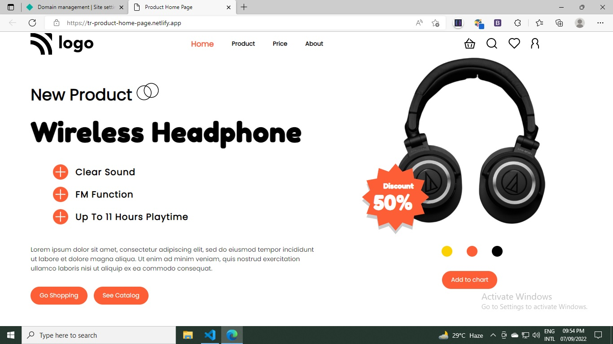
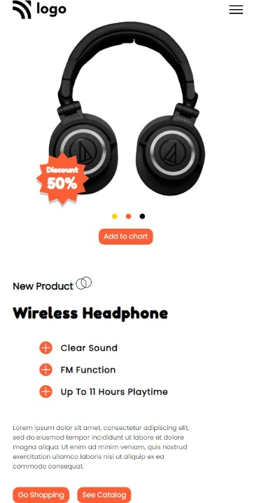

# Hi, This is Torjuman Rimon.

This is a Responsive home page which is most like "Product Home Page". It is one of the live class project from iNeuron's Full Stack JavaScript Bootcamp given by **[Hitesh Sir](https://github.com/hiteshchoudhary)**

## Image from this project

### Desktop view

### Mobile view

All the images, icons and HTML file was given to me. And I need to make this home page as it was instructed.

- **What I have learnd in this project**

  - Media Queries
  - Icons placement
  - Mobile view
  - Filter drop shadow
  - Hide elements at certain break point

- **Time needed to finish this project**

  - 6 : 00 hours

- **[Live Link](https://tr-product-home-page.netlify.app/)**

# Tech used

 

